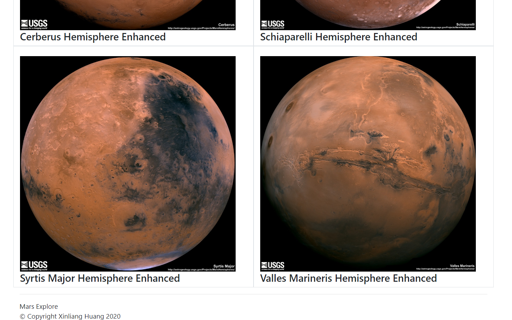

# web-scraping-challenge

## Summary ##
This project is designed to build a web application that scrapes various websites for data related to the Mission to Mars and displays the information in a single HTML page.
Flask is used to deploy the scraped data to the HTML.

## Data ##
-[NASA Mars News Site](https://mars.nasa.gov/news/) 
-[JPL Featured Space Image](https://www.jpl.nasa.gov/spaceimages/?search=&category=Mars) 
-[Mars Weather twitter account](https://twitter.com/marswxreport?lang=en)
-[Mars Facts webpage](https://space-facts.com/mars/)
## Tool ##
JavaScript, Python, Chromedriver
## Visualization ##
### HTML ###

Email:xinlianghuang85@gmail.com